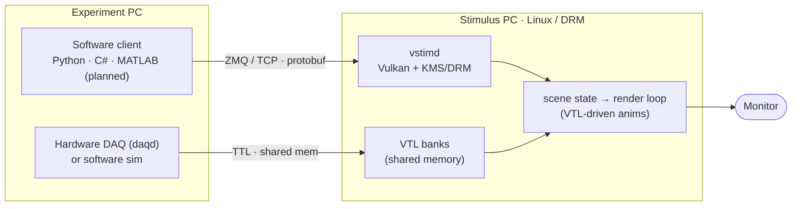
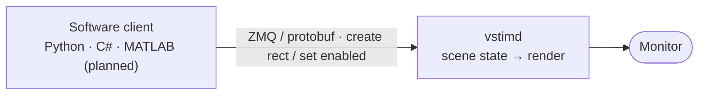
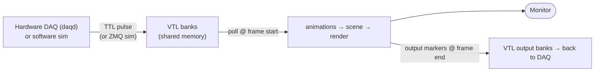

# vstimd

!!! danger "Alpha software — not ready for production"
    vstimd is in **early alpha**. The APIs, wire protocol, and behaviour can change at
    any time, features are incomplete, and it has **not** been validated for experiments
    or data collection. Use it for evaluation and development only — **do not rely on it
    in production yet**.

**vstimd** is a visual stimulus server for neuroscience experiments. It runs on dedicated
hardware and accepts commands from experiment scripts over the network, rendering stimuli with
precise, vsync-locked frame timing.

vstimd is controlled along two complementary paths: **direct** commands from a software
client over ZMQ/protobuf, and **trigger-driven** reactions via Virtual Trigger Lines (VTL)
fed by hardware DAQ or a software simulator.

!!! tip "New here? Start with these"
    - **[Why vstimd?](why-vstimd.md)** — what a dedicated timing device buys you over
      PsychoPy / Psychtoolbox / MWorks, and how it fuses with ephys and imaging.
    - **[Choosing an API path](tutorial/index.md)** — the two ways to drive vstimd and
      when to use each, with hands-on tutorials.



## Two ways to control vstimd

Stimuli can be driven along two complementary paths. Most experiments use both: a
software client sets the scene up, and hardware trigger lines drive the timing-critical
reactions frame-by-frame.

**Path 1 — Direct control (imperative).** A software client sends commands over
ZMQ/protobuf that take effect on the next frame: create a stimulus, set its position,
enable or disable it.



**Path 2 — VTL-driven animations (reactive).** *Virtual Trigger Lines* (VTL) are a bank
of trigger bits in POSIX shared memory. A hardware bridge (e.g. `daqd`) maps real TTL
lines onto them — or a software client simulates lines over ZMQ. vstimd polls them once
per frame with zero syscall overhead, and **animations** react to edges/levels to drive
stimulus visibility, position, and output markers in hardware time — no round-trip back
to the experiment PC.



Animations are declarative (flash for N frames, couple visibility to a line, move along a
path, …) and carry a rich start/final/cancel action vocabulary. Because vstimd both reads
input lines and writes output lines each frame, animations can even **chain each other
entirely inside the server**, staying synchronised to the display and to DAQ markers.

## Key features

- **Frame-accurate stimulus timing** — vsync-locked render loop, DRM vblank wait
- **Cross-language clients** — Python, MATLAB *(planned)*, C# (and PsychoPy-compatible Python layer)
- **Bare-metal Linux rendering** — runs without a compositor (X11/Wayland) via KMS/DRM
- **Deferred mode** — batch multiple stimulus changes into a single atomic frame flip
- **Virtual Trigger Lines (VTL)** — hardware TTL / software triggers via shared memory drive frame-accurate, trigger-reactive animations with no DAQ code inside vstimd
- **Live debug overlay** — frame timing, stimulus list, command log (toggle with F1)

## Stimulus types

| Type | Description |
|---|---|
| Rectangle | Axis-aligned filled rectangle with optional outline |
| Circle | Filled circle |
| Ellipse | Filled ellipse |
| Grating | Analytical sinusoidal grating with aperture masks and drift |
| Text | Rendered text with configurable font, size, colour, and anchor |

## Quick start

=== "Python"

    ```python
    from vstimd import Connection
    from vstimd.stimuli import Vec2, Color

    with Connection("tcp://stimulus-pc:5555") as conn:
        h = conn.stimuli.shapes.create_rect(pos=Vec2(0, 0), width=200, height=100,
                                            color=Color(1.0, 0.0, 0.0))
        conn.stimuli.set_enabled(h, True)
        conn.stimuli.delete(h)
    ```

=== "PsychoPy"

    ```python
    from vstimd.psychopy import visual

    win = visual.Window(address="tcp://stimulus-pc:5555")
    rect = visual.Rect(win, width=0.5, height=0.25, fillColor="red")
    rect.draw()
    win.flip()
    ```

=== "MATLAB (planned)"

    !!! note "The MATLAB client is planned — it does not exist yet."

    ```matlab
    conn = vstimd.Connection('tcp://stimulus-pc:5555');
    h = conn.stimuli.create_rect('x', 0, 'y', 0, 'width', 200, 'height', 100, ...
                                 'r', 1.0, 'g', 0.0, 'b', 0.0);
    conn.stimuli.set_enabled(h, true);
    conn.stimuli.delete(h);
    conn.close();
    ```
